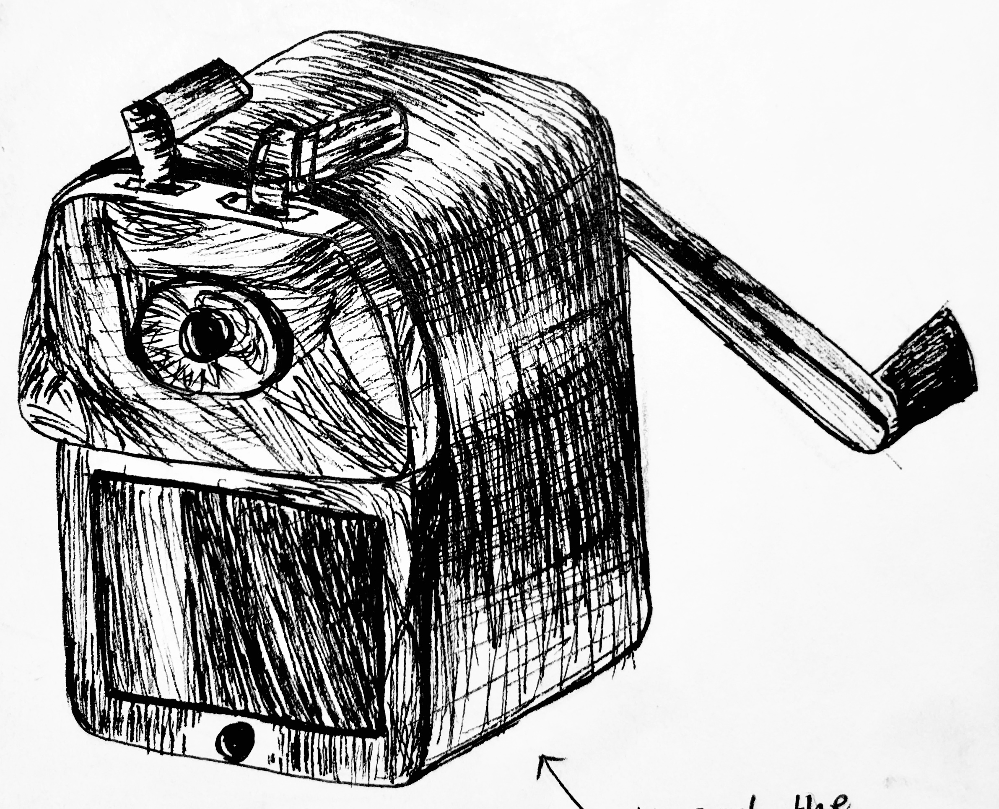
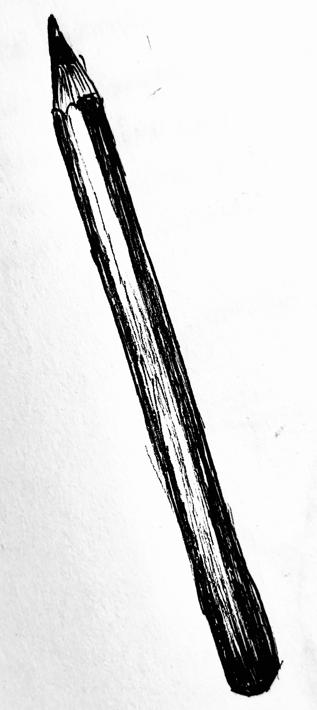
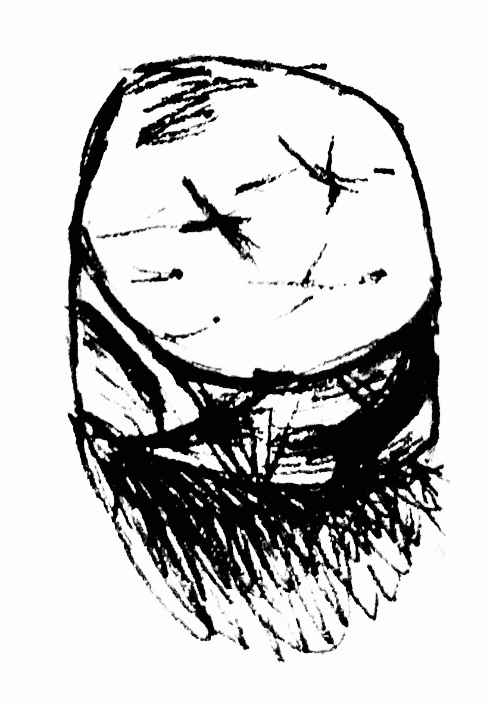
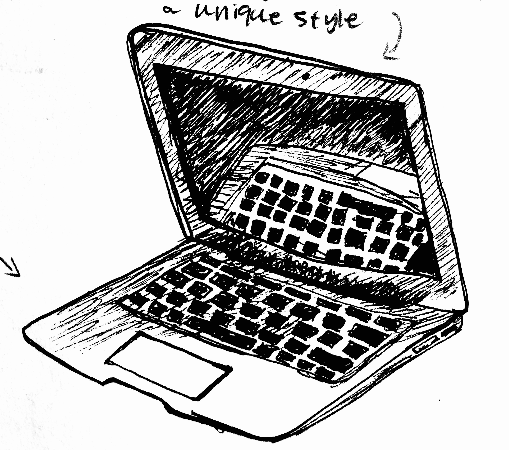
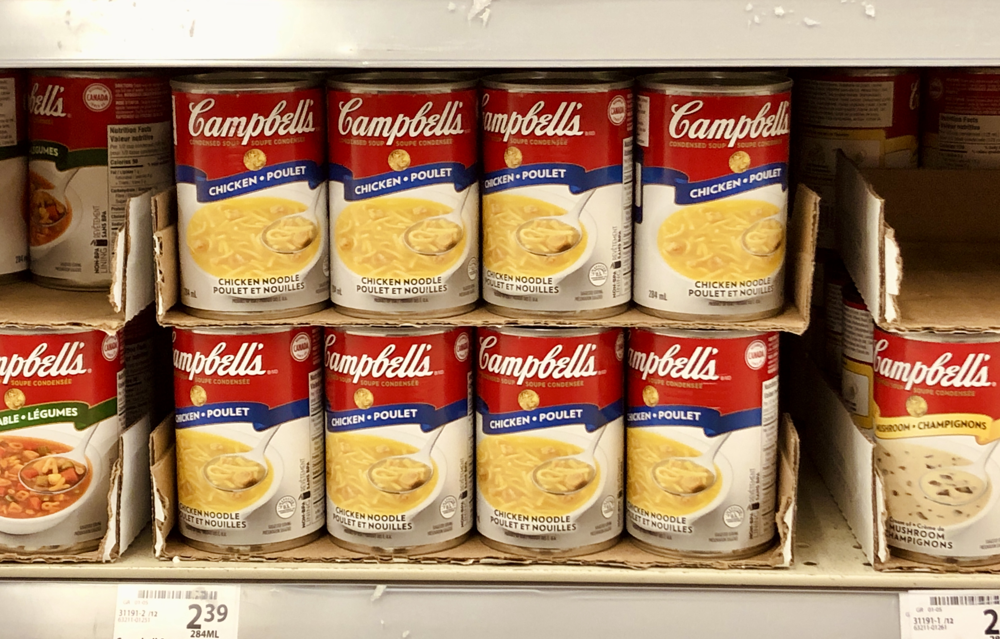
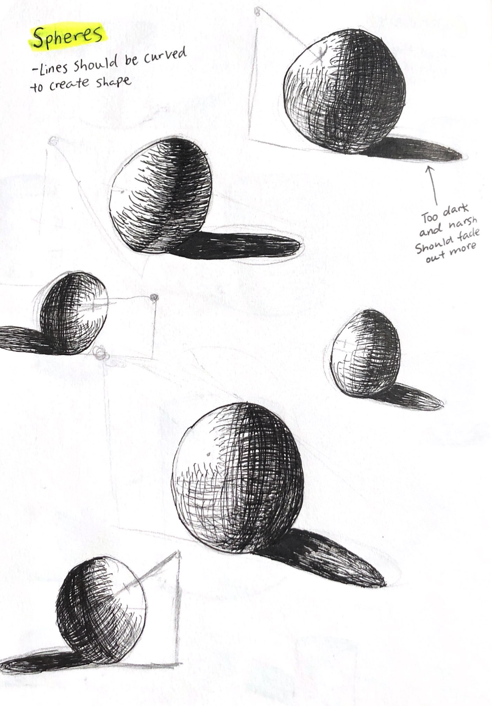
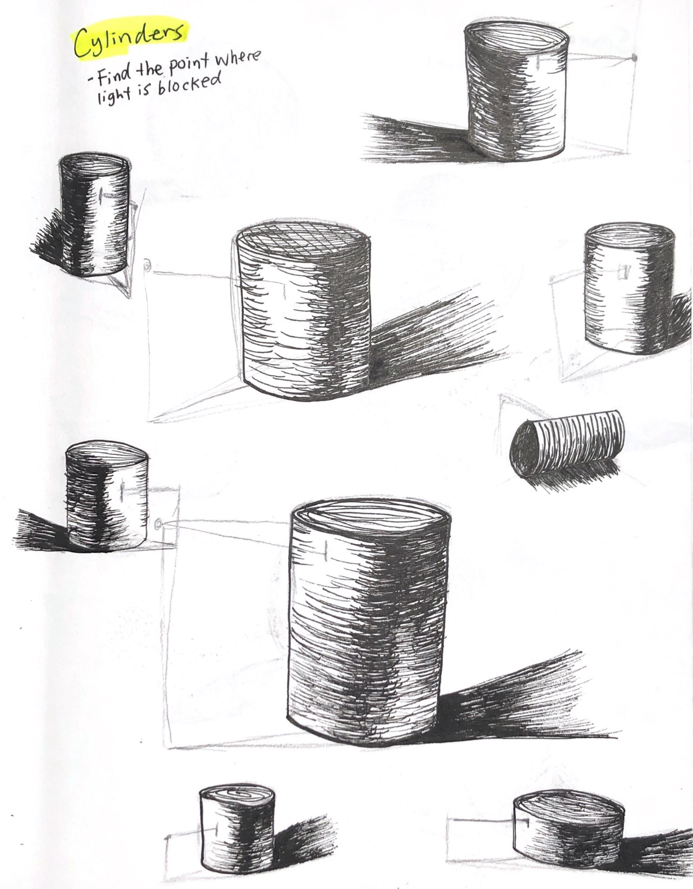

# Ideas · Updated March 1, 2023 

A peak into my sketchbook and the spontaneous ideas within it and beyond! (In chronological order.)

## Whistler

Snowwy mountains at Whistler (or maybe it was Blackcomb?)



## On my desk

Drawing with pen to capture objects on my desk. (Need to strip the background or tone it to white so it matches background of website!!)

## Inspiration

Saw some of Andy Warhol's artwork at the store!

## Impact

Helped Millennium STEM BC, a youth-led not-for-profit organization based in Canada, design a sponsorship package. Clearly showcased the various tiers of sponsorship and the benefits of each tier.



## Exploration

Visited my favourite place in Vancouver!



## Spheres and Cylinders

## Vebr

Created a website mockup for a web design agency known as Vebr (pronounced /ˈwebər/).


